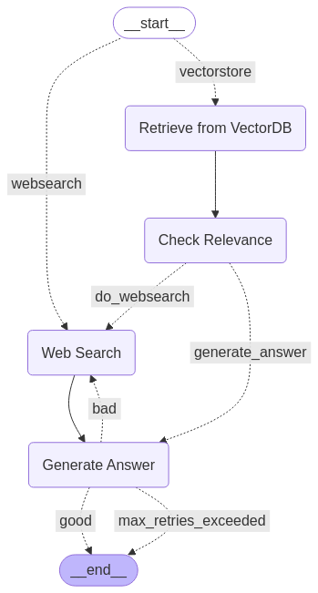

Based on this [Langgraph tutorial](https://langchain-ai.github.io/langgraph/tutorials/rag/langgraph_adaptive_rag_local/#components)

An LLM agent build usig langchain and langgraph, with functinality such as web search and semantic search.



## Tools Used:
1. [Ollama](https://ollama.com/download)
    - To run LLMs locally
2. [LangChain](https://python.langchain.com/docs/introduction/), [LangGraph](https://langchain-ai.github.io/langgraph/)
    - For building the ai-agent
    - Visualization of the agent
3. [Nomic Embeddings](https://www.nomic.ai/blog/posts/nomic-embed-text-v1)
    - Used for semantic search using vector embeddings 

## How to run:
1. Install the dependencies
    ```shell
    pip install -r requirements.txt
    ```
2. Download and install [Ollama](https://ollama.com/download)
3. Fetch a model, such as llama3.2 (default in the repo is llama3.2:3b-instruct-fp16) to run the inference locally:
    ```shell
    ollama pull llama3.2
    ```
4. Set Tavily Key (For web search API):
    ```shell
    export $TAVILY_API_KEY = <TAVILY API KEY>
    ```
5. Set langgraph key
    ```shell
    export LANGSMITH_API_KEY = <LANGSMITH API KEY>
    ```
6. Run the agent
    ```shell
    python rag_agent.py
    ```
7. Or run the notebook ```experiment.ipynb``` to see the agent in action

## Sample Run
**python rag_agent.py**
```shell
Verifying prompts...
Prompts checks passed.
Embedding texts: 100%|█████████████████████████████████████████████████████████████████████████████████████████████| 69/69 [00:12<00:00,  5.33inputs/s]
Embedding texts: 100%|███████████████████████████████████████████████████████████████████████████████████████████████| 1/1 [00:00<00:00, 14.78inputs/s]
```
```Enter Question (or 'exit' to quit) >> Which teams have won the ODI world cup and when?```
```shell
## ROUTE QUESTION ##
Datasource: vectorstore
## RETRIEVE ##
{'Retrieve from VectorDB': {'documents': ['2015\nAustralia and New Zealand\nAustralia\n186–3\nNew Zealand\n183\nAustralia won by 7 wickets\n\n\n2019\nEngland and Wales\nEngland<TRUNCATED TEXT>']}}
## CHECK RELEVANCE ##
No web search needed
{'Check Relevance': {'documents': ['2015\nAustralia and New Zealand\nAustralia\n186–3\nNew Zealand\n183\nAustralia won by 7 wickets\n\n\n2019\nEngland and Wales\nEngland<TRUNCATED TEXT>'], 'web_search_needed': False}}
## GENERATE ANSWER ##
## CHECKING HALLUCINATION ##
Answer is good. No hallucination detected. Exiting.
{'Generate Answer': {'answer': 'Based on the provided context, the following teams have won the ODI World Cup and their respective years of victory are:\n\n1. Australia - 6 times (1987, 1999, 2003, 2007, 2015, 2023)\n2. England - 1 time (2019)\n3. India - 2 times (1983, 2011)\n4. West Indies - 2 times (1975, 1979)\n5. Pakistan - 1 time (1992)\n6. Sri Lanka - 1 time (1996)', 'num_retries': 1}}
Based on the provided context, the following teams have won the ODI World Cup and their respective years of victory are:

1. Australia - 6 times (1987, 1999, 2003, 2007, 2015, 2023)
2. England - 1 time (2019)
3. India - 2 times (1983, 2011)
4. West Indies - 2 times (1975, 1979)
5. Pakistan - 1 time (1992)
6. Sri Lanka - 1 time (1996)
```
